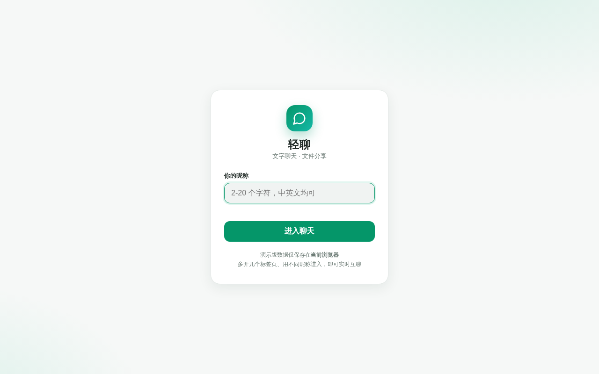
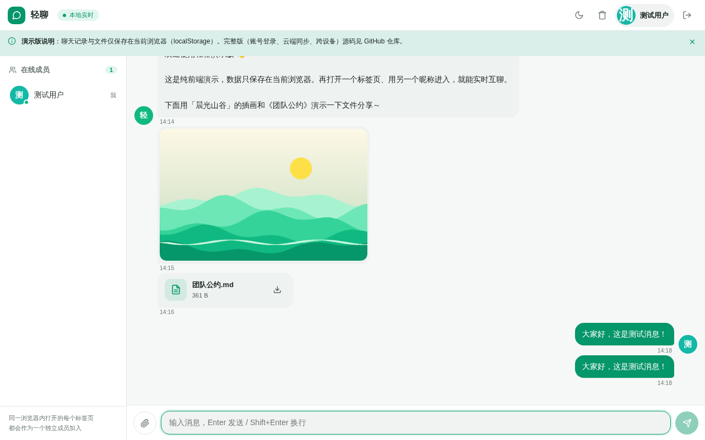
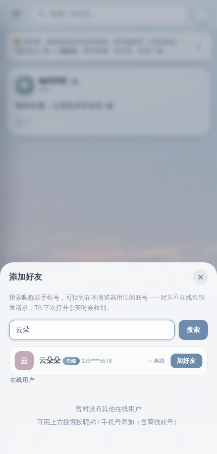
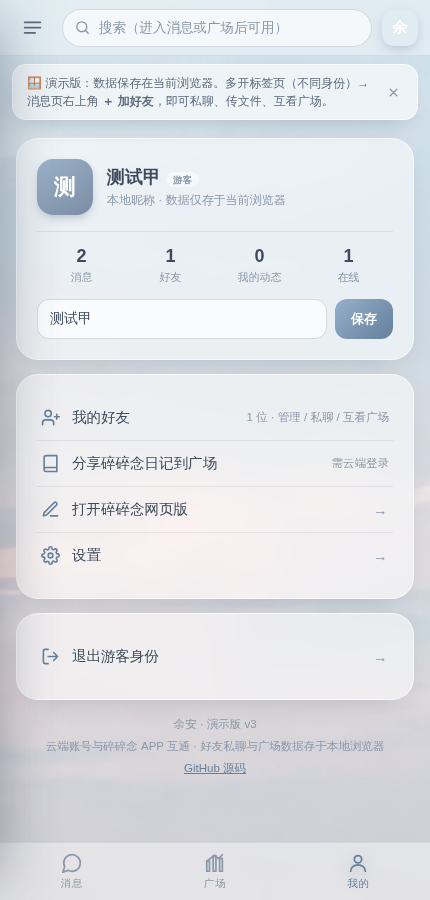

# 余安 Beta · 浮云深处，岁岁余安

一个轻盈的沟通小站：**消息 · 好友 · 广场**，与「碎碎念」APP 账号云端互通。

**[🌐 在线体验](https://shimucheng12-art.github.io/yu-an/)**

| 登录 | 消息 |
| :---: | :---: |
|  |  |

| 广场 | 我的 |
| :---: | :---: |
|  |  |

## ✨ 功能

### 💬 消息
- 消息页为**会话列表**：余安大厅 + 好友私聊，未读红点（底部标签 / 侧栏 / 会话行）
- 大厅：文字 + 图片消息，图片自动压缩、点击查看大图，在线人数、正在输入提示、日期分组
- 私聊：**文字、图片、文件传输**（≤2MB，可点击下载），实时互通
- 历史消息搜索

### 👥 好友
- 在线用户发起好友请求 → 对方弹窗确认，双向实时同步
- **按昵称 / 手机号搜索添加**：可找到在本浏览器登录过的账号（云端账号显示脱敏手机号）；**对方离线也能发请求**，TA 下次打开余安时会收到弹窗确认，接受后双方自动成为好友
- 好友管理（「我的 → 我的好友」）：查看 TA 的广场 / 发起私聊 / **解除好友**（双方同步，聊天记录一并清除）
- 广场权限：动态**仅自己与好友可见**，非好友互不可见
- 好友广场主页：点好友名或私聊页按钮，查看 TA 的全部动态

### 🏞️ 广场
- 发布图文动态，点赞互动
- **与碎碎念 APP 联动**：云端登录后可一键把日记分享到广场（只读拉取，不改动碎碎念的数据）
- 动态搜索

### ☁️ 账号互通（碎碎念）
- 使用「碎碎念」APP 的**手机号 + 短信验证码**登录，无需另行注册
- 与 [碎碎念网页版](https://shimucheng12-art.github.io/life/) 共享登录会话：在那边登录过，这边自动识别
- 登录后可拉取云端日记分享到广场
- 不登录也可以游客身份直接体验

## 📱 Android APK

把余安装进手机：仓库提供 Android 壳工程（`android/`，WebView 封装线上版），APK 托管在 [Releases](https://github.com/shimucheng12-art/yu-an/releases)。

- **[⬇️ 下载 yu-an-v3.2.apk](https://github.com/shimucheng12-art/yu-an/releases/latest/download/yu-an-v3.2.apk)**（约 140 KB）
- 安装：手机上直接打开 APK，允许「安装未知应用」即可，无需 USB 与开发者模式
- 图标取自「城市黄昏 · 晚霞与塔」摄影作品；打开即用，首次启动需联网，断网时显示轻量离线页（恢复后一键重连）
- 私聊文件（≤2MB）可保存到系统「下载」目录；选择图片/文件发消息均正常可用
- 仅申请网络权限；APK 数据保存在应用自身存储，与浏览器版相互独立
- 说明：好友互聊与搜索添加依赖「同一浏览器」的本地机制（与网页版一致），APK 单窗口内暂无法演示；云端账号（碎碎念登录 / 日记分享）与完整界面不受影响
- 自行构建：`android/build.sh`（需 JDK 17 + Android SDK build-tools 34 / platform 34）

## 🎨 设计

- 背景：雾蓝粉调云层摄影 + 莫兰迪配色 + 毛玻璃（backdrop-filter）卡片
- 移动端 APP 式交互：顶部搜索栏、左侧抽屉菜单（应用信息 + 功能导航 + 扫一扫/设置/我的）、底部标签栏
- 桌面端居中「手机框」展示，自适应深浅环境
- 单文件实现（`index.html`），零依赖、零构建，可直接双击打开

## 📁 项目结构

```
├── index.html        # 应用本体（自包含单文件）
├── assets/           # 云层背景图与 README 截图
├── 团队公约.md        # 示例素材
├── 晨光山谷.png       # 示例素材（广场示例动态）
├── .github/          # GitHub Pages 自动部署工作流
├── android/          # Android APK 壳工程（WebView 封装线上版）
├── src/              # 完整版源码（Next.js + Socket.io + SQLite）
└── mini-services/    # Socket.io 实时服务
```

## ☁️ 账号互通原理

余安调用碎碎念的阿里云函数计算后端（`cloud-fc`，见 [life 仓库](https://github.com/shimucheng12-art/life)）：

- 登录：`POST /api/auth/sms/send` + `POST /api/auth/sms/login`（手机号验证码 → JWT）
- 拉日记：`GET /api/data`（只读，解析 `diaries` 数组后分享到广场；**不回写**，避免干扰碎碎念的云同步）

两个站点同属 `shimucheng12-art.github.io` 域，云端 API 的 CORS 白名单直接放行，登录态（JWT）在 localStorage 中互通。

## 🔧 完整版（仓库源码）

`src/` 目录保留了上一代的完整全栈实现（Next.js 16 + Prisma/SQLite + Socket.io + JWT 账号系统），本地运行与部署方法见提交历史中的旧版 README。

## ☁️ 余安 Beta 云端版

本版本的目标是彻底脱离浏览器本地数据，核心账号与好友关系由云端 API + PostgreSQL 保存。

### 内测范围

目前只优先保证一件事：**跨设备添加好友**。

流程：

1. 设备 A 注册/登录账号；
2. 在「好友」里按用户名搜索设备 B 的账号；
3. A 发送好友请求；
4. B 在另一台手机登录同一云端服务；
5. B 打开「好友」即可看到请求并同意；
6. 双方好友关系写入云端，两台设备都可以继续看到好友关系。

好友请求不是依赖 localStorage，也不要求双方同时在线；好友窗口打开时会自动刷新云端状态。

### 无需自建服务器（EdgeOne Pages + Neon，全程免绑卡）

云端方案：**EdgeOne Pages**（腾讯，Next.js 全栈托管，免费版永久免费、GitHub 登录、无需绑卡，
默认域名 `*.edgeone.app` 国内可直连）+ **Neon**（免费 0.5GB PostgreSQL）。

> 历史备注：曾使用 Vercel（`*.vercel.app` 在国内被 DNS 污染，手机直连不通，故迁移）。
> Vercel 上的旧部署与本项目共用同一数据库，海外网络仍可访问。

实时消息采用轮询（`/api/sync`，3 秒间隔），因此单服务即可运行，无需长连接进程。
文件与图片直接存数据库（serverless 平台文件系统只读），图片上传前会在客户端压缩。
数据库地址已内置在 `src/lib/db.ts`（可用环境变量 `DATABASE_URL` 覆盖），**部署时无需配置任何环境变量**。

部署步骤：

1. 打开 [pages.edgeone.ai](https://pages.edgeone.ai)，用 GitHub 登录；
2. 创建项目 → 从 GitHub 导入本仓库，框架自动识别为 Next.js；
3. 构建命令默认 `npm run build` 即可，直接部署；
4. 部署完成后使用分配的默认域名（`https://<项目名>.edgeone.app`），
   并据此更新 `android/res/values/strings.xml` 中的 `home_url` 后重新构建 APK。

> 技术说明：数据层使用 `pg` 驱动直连 PostgreSQL（纯 JS、零二进制依赖），
> 曾用 Prisma ORM，为满足托管平台函数包 128MiB 体积限制而移除；
> 表结构见 `db/schema.sql`。

### 本地部署

环境变量见 `.env.example`：

- `DATABASE_URL`（可选，未配置时使用内置云端数据库）

数据库建表（参考 `db/schema.sql`）：

```bash
psql "$DATABASE_URL" -f db/schema.sql
```

然后启动：

```bash
npm run build
npm run start
```

### 云端健康检查

`.github/workflows/smoke-test.yml` 可手动触发（Actions → Smoke Test → Run workflow），
在云端注册临时账号并发送一条消息，验证线上服务与数据库连通性。

### Android Beta

Android 壳默认地址：

```text
https://yu-an2.vercel.app/
```

如果你的云端服务使用其他域名，只需修改：

```text
android/res/values/strings.xml
```

中的 `home_url` 后重新运行：

```bash
cd android
SDK_ROOT=<android-sdk 路径> KS=<签名密钥路径> ./build.sh
```

产物为 `yu-an-v4.1-beta.apk`。

签名说明：

- APK 使用固定密钥签名（`yu-an.keystore`，密码 `yuanyuan`，密钥文件不进仓库）；
- 之后每次更新都用同一密钥签名，新 APK 可直接覆盖安装，无需卸载；
- 云端 Actions 构建需要把密钥 base64 后配置为 Secret `ANDROID_KEYSTORE_B64`（当前未配置时会构建失败，属预期）。

### 当前版本与旧版的区别

旧版好友逻辑依赖浏览器本地机制，因此换设备无法可靠共享好友关系。

Beta 版新增：

- 云端 User / FriendRequest / Friendship 数据模型
- 用户名搜索
- 发送好友请求
- 离线好友请求
- 跨设备接受好友请求
- 好友关系双向持久化
- 解除好友
- 好友数据 10 秒自动刷新
- 更简洁的好友弹窗入口


## 许可

供学习与个人使用，欢迎参考改造。
